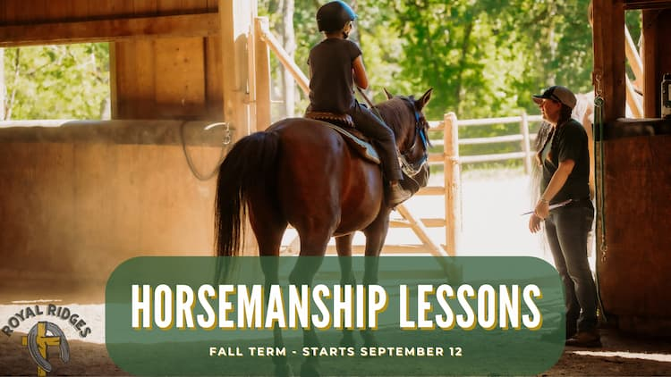

    
Where:&nbsp;Royal Ridges

    
When:&nbsp;Starting September 12

    
Tues & Thur:&nbsp;4:30-6:30pm

Wed:&nbsp;10:00-12:00pm

    
Cost:&nbsp;$45 a lesson

 Is your child new to horses and wanting to learn how to ride? Have they been riding for years and want to improve? Our weekly horsemanship lessons are a great way for them to learn and grow their horsemanship skills. We offer group lessons on Tuesday and Thursday evenings as well as Wednesday mornings. Each lesson is 2 hours and includes horse science, Bible study, and a one-hour arena lesson. Our Fall Term starts September 12.

  <a 
        href='https://www.ultracamp.com/info/upcomingSessions.aspx?idCamp=1145&campCode=151'
        className='text-green-200 hover:text-indigo-400 hover:underline font-cursive text-2xl'
        target='_blank' 
        rel='noopener noreferrer'
    >Register for Horsemanship Lessons</a>

