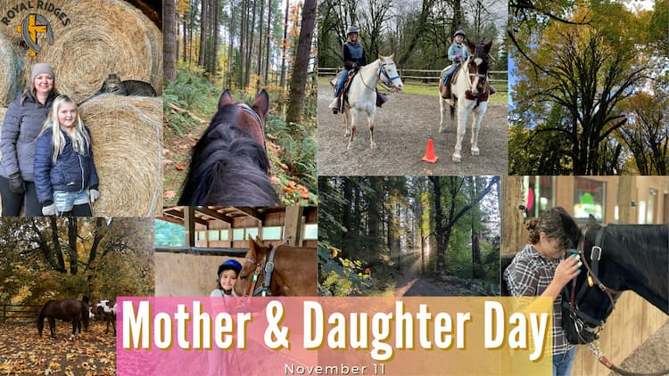

    
Where:&nbsp;Royal Ridges

    
When:&nbsp;October 14 & November 11

    
Time:&nbsp;9:00 am - 4:00 pm

    
Cost:&nbsp;$90 a participant

Cost:&nbsp;Minimum age: 6 years old

Join us for our Mother & Daughter Day. It is a fun way for moms and daughters to bond and enjoy a fun day of camp together. The ladies will ride, do a fun craft together, learn about horses, and have some great mother-daughter bonding time. Lunch is included.

    
Mother & Daughter Day: October 14

 
Mother & Daughter Day: November 11

    <a 
        href='https://www.ultracamp.com/info/upcomingSessions.aspx?idCamp=1145&campCode=151'
        className='text-green-200 hover:text-indigo-400 hover:underline font-cursive text-2xl'
        target='_blank' 
        rel='noopener noreferrer'
    >Register for Parent-Child Days</a>

