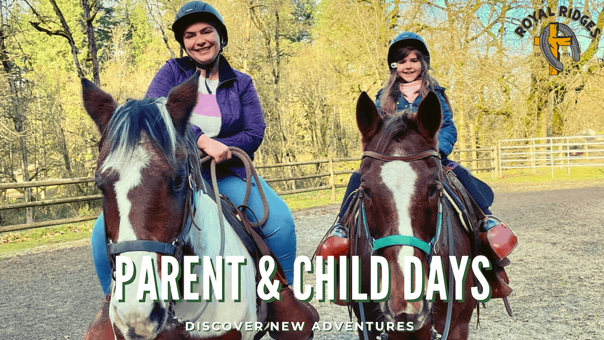

We are kicking off our Spring Parent and Child Days. This is an excellent opportunity for parents to bring their children out to Royal Ridges for the day and share the experience of being campers. Our purpose for these programs is to provide opportunities to create unforgettable memories for families that will last a lifetime. Click on the links below to register for our parent & child day.

**Mother & Daughter:**

*Dates: April 30, 2022 (6 yrs old & up-arena ride only)*

*May 7, 2022 (9 yrs old and up)*

Time:  Saturday, 9:00 am to 4:00 pm

Location: Upper Camp

Cost:$90 per person
<a 
    href='https://www.ultracamp.com/info/upcomingSessions.aspx?idCamp=1145&campCode=151&lnkCategory=Mother%2fDaughter+Day'
    className='text-green-200 hover:text-indigo-400 hover:underline'
    target='_blank' 
    rel='noopener noreferrer'
> Register for Mother-Daughter Day</a>

**Father & Son:**

*Date: April 30, 2022*

*Time: 9:00 am - 4:00 pm*

Ages: 6 and up

Price: $90 per person 

<a 
    href='https://www.ultracamp.com/info/upcomingSessions.aspx?idCamp=1145&campCode=151&lnkCategory=Father%2fSon+Day'
    className='text-green-200 hover:text-indigo-400 hover:underline'
    target='_blank' 
    rel='noopener noreferrer'
> Register now for Father-Son Day</a>

