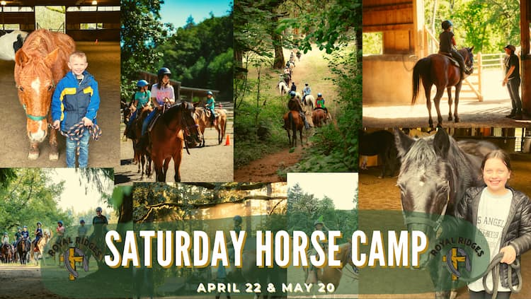

    
Where:&nbsp;Royal Ridges

    
When:&nbsp;Saturday: April 22, Trail Ride Day. May 20, Ranch Day.

    
Time:&nbsp;9:00am - 3:00pm

    
Cost:&nbsp;$75 a participant
 

Saturday horse camps are back, and we’re offering theme Horse Camps this year, one Saturday a month. On Trail Ride Day, April 22, campers will experience riding our extensive network of trails that cross all over our property from woods, pastures, streams, and around our lake. This is a fun day of exploring camp on horseback. For our Ranch Day on May 20, campers will learn the finer points of what it takes to sort cows and practice their roping skills. These Saturday camps are great for getting your kid's toes wet in different riding styles.

    <a 
        href='https://www.ultracamp.com/info/upcomingSessions.aspx?idCamp=1145&campCode=151'
        className='text-green-200 hover:text-indigo-400 hover:underline font-cursive text-2xl'
        target='_blank' 
        rel='noopener noreferrer'
    >Register for Saturday Horse Camp </a>

