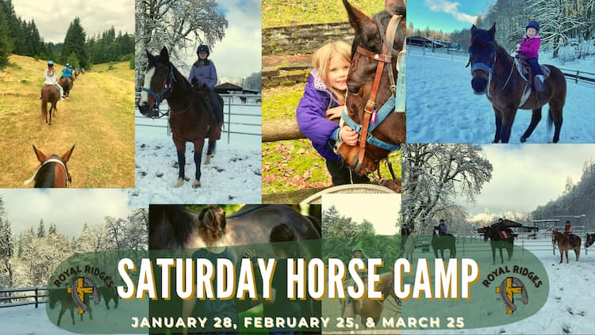

Where:&nbsp;Royal Ridges

When:&nbsp;Saturday: January 28, February 25: English Riding, and March 25: Gaming Patterns

Time:&nbsp;9:00am - 3:00pm

Cost:&nbsp;$75 a participant
 

Saturday horse camps are back, and we’re offering theme Horse Camps this year, one Saturday a month, January-March. For English day, riders will learn about English and Western tack differences and have an English riding lesson. On Gaming Patterns day, campers will learn about ranch rodeo events and practice a few of them in the saddle. These Saturday camps are great for getting your kid's toes wet in different riding styles. Click on the image above for more information. 

    <a 
        href='https://www.ultracamp.com/info/upcomingSessions.aspx?idCamp=1145&campCode=151'
        className='text-green-200 hover:text-indigo-400 hover:underline font-cursive text-2xl'
        target='_blank' 
        rel='noopener noreferrer'
    >Register for Saturday Horse Camp </a></div>