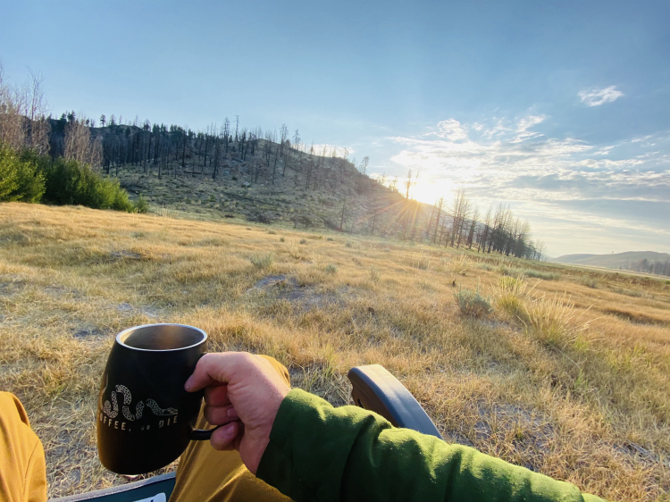

Crunch, crunch, crunch my skin track beats on like a metronome. Giving my thoughts a beat to compose by.

What would it feel like I wonder? Peace and beauty replaced instantly with fear and noise and almost as fast replaced by silence… and blackness? Why the hell am I thinking about this?

Maybe it is because you are out here alone! I say out loud to myself, almost without realizing.

I push the thoughts of doubt and fear out of my head and instead focus on the snow. A vigintillion of unique particles, sparkling in the light, and crunching beneath my weight. I must keep myself focused and my thoughts away from the apparition of doom and instead focus on the facts. I stop and plunge my hand into the snow, assessing the snow pack. Is there wind? Is it getting too warm too fast? What was the weather like last night? Whump! I turn to look behind me, a load of snow just slid off a nearby branch with a thud making me think that I am not here alone. That someone has heard me talking to myself. I see only my tracks and a lot of white. I smile. I have been a rock climber for much longer than I have been a skier. I always sought to leave my mark, not in a permanent way but rather a way that could not be forgotten by mankind - maybe a radical first ascent or stupendous tale that future generations will tell further altering the original event into super-hero proportions. After climbing a route, there is nothing there to mark my passage. Maybe a note in my guidebook. But how many climbs have I climbed and forgotten? No record of passage, even in my own mind. No proof that I even existed or was there to climb it. However, with skiing my mark is there for all to see. The arcing, carving, spraying mark of my decent or my skin track marking my chosen route of ascent. Crunch, crunch, crunch… I am at the top of my own beautiful snowfield. At least for today it is my canvas to leave my mark. It may be an infants penmanship compared to the masters calligraphy that is displayed for all to see on magazine covers, movies, and sponsorship contracts that I drool over without reservation - but it is my mark. I may not be a god among men but for awhile everyone who bothers to venture out here will see my tracks on the side of this mountain… At least until the next snow or big thaw. Every decent is a first decent in its own right, and it always resets. This slope will never be exactly the same. Ever again. There is only one constant and that is change. I peal off my skins and tuck them into my jacket to keep them warm and recite the back country skiers creed…

These are my skis. There are many like it, but these are mine. They are my life. I must master them as I must master my life. Without me my skis are useless. Without my skis, I am useless.
I must carve my skis true. My skis and I know that what counts on this tour is not the number of turns we make, the noise of my whoops of glee, or the cold smoke we chase. We know that it is the solitude, beauty, and coming home that count.
My skis are human, even as I am human, because they are my life. Thus, I will learn them as a lover. I will learn their weaknesses, their strengths, their parts, and their bindings. I will keep my skis clean and ready, even as I am clean and ready. We will become part of each other.
Before God I swear this creed. My skis and I are the explorers of the back country. We are the masters of the snow. We are the saviors of my life.
So be it, until fresh tracks are ours and there is no off season.

… and shove off to leave my mark on humanity - my fleeting legacy - if only for a moment.