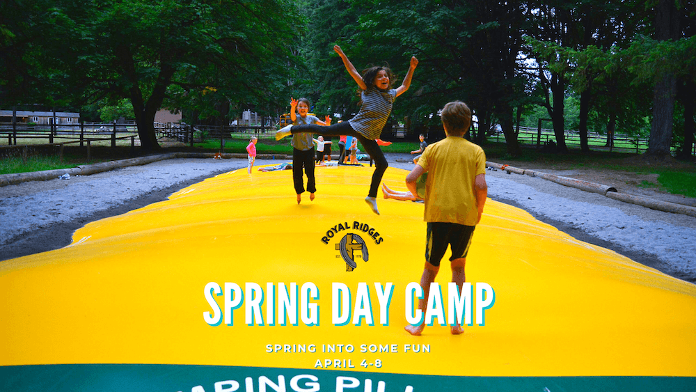

Our Spring Day Camp is back again this year. We are excited to have even more options than last year. Choose either Traditional Day Camp or Day Horse Camp - either way, your child is sure to have a great time! Spring Break Day Camp will be 5-days jam-packed with spring fun, new friends, and exciting activities. Bus service will be available with limited stops. Let's spring into fun this year! Follow the links below for more information.

**April 4 - 8**

*8:30am - 3:30pm*

## Bus Service:

**East Route:**

**NW Gospel Church**

305 NE 192nd Ave, Vancouver, WA 98684 

8:10 AM - Departure Time

4:35 PM - Drop Off Time

**NorthWest Parking Lot in Front of the Church**

**Brush Prairie Baptist Church**

11814 NE 117th Ave, Vancouver, WA 98662 

8:30 AM - Departure Time

4:05 PM - Drop Off Time

**NW Corner of Main Parking Lot off of 119th St**

\
**West Route**

**Albertsons at Salmon Creek**

 8:15 AM - Departure Time   

4:10 PM - Drop Off Time - Final Stop

14300 NE 20th Ave Vancouver, WA 

**Northside by Dumpster** 

**Battle Ground Baptist**

8:35 - Departure Time

3:50 - Drop off Time

1110 NW 6th Ave., Battle Ground, WA

**FRONT PARKING LOT**   

  <a href="https://www.ultracamp.com/info/upcomingSessions.aspx?idCamp=1145&campCode=151&lnkCategory=Spring+Break+Camp">
    Spring Day Camp Registration
  </a>

