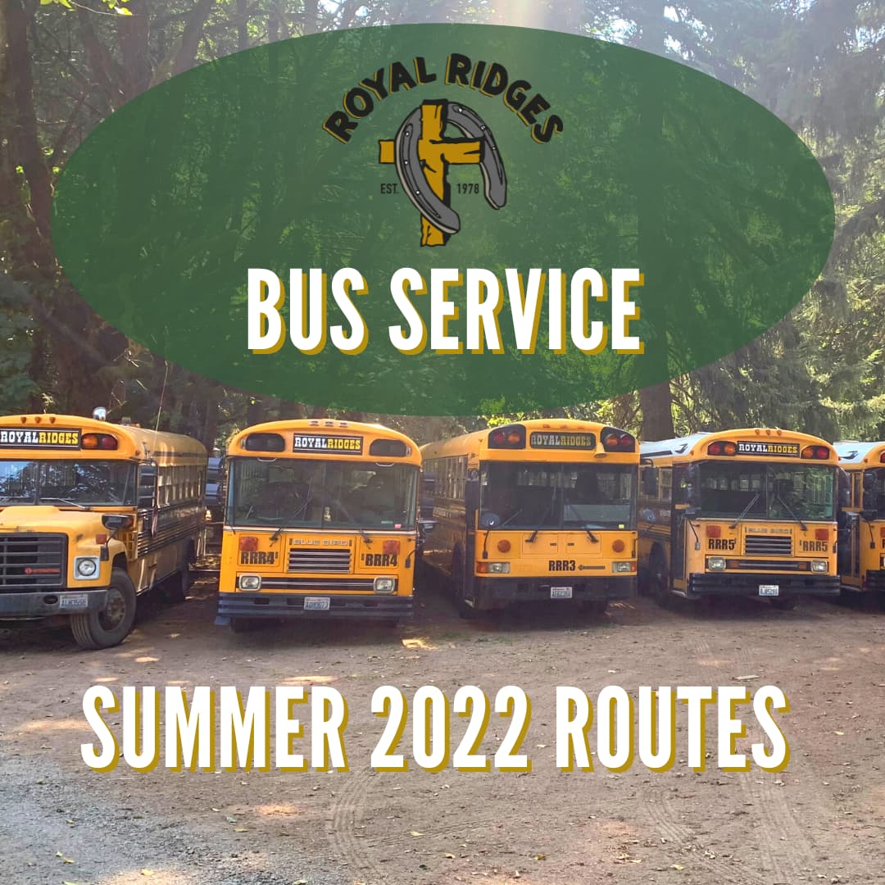

### <https://royalridges.org/bus-transportation>

### East One Bus Route

#### NW Gospel Church - Camas

7:50am - Departure Time

4:20pm - Drop Off Time (Final Stop)

[1420 NE 3rd Avenue Camas, WA](https://goo.gl/maps/NPJ6W8WAqDRRATzj7)

#### NW Gospel Church - East Vancouver

8:10am - Departure Time

4:00pm - Drop Off Time

[305 NE 192nd Avenue Vancouver, WA](https://goo.gl/maps/hpvKZQcPRKAxzEKo9)

### East Two Bus Route

#### East Park Church

8:05am - Departure Time

4:15pm - Drop Off Time (Final Stop)

[15815 NE 18th Street Vancouver, WA](https://goo.gl/maps/qKhgGZcQhy5oNzPV8)

(NE Side of parking lot)

#### Fourth Plains Church of the Nazarene

8:20am - Departure Time

4:00pm - Drop Off Time

[16807 NE Fourth Plain Boulevard Vancouver, WA](https://goo.gl/maps/YKX8bJS4H76KNDXp6)

### East Three Bus Route

#### Brush Prairie Baptist Church

8:15am - Departure Time

4:00pm - Drop Off Time (Final Stop)

[11814 NE 117th Avenue Vancouver, WA](https://goo.gl/maps/Lewa8HyenUBhNw2q9)

#### Battle Ground Baptist Church

8:30am - Departure Time

3:50pm - Drop Off Time

[1110 NW 6th Avenue Battle Ground, WA](https://goo.gl/maps/cTXDh6qwmtNUxHHQ7)

(Front parking lot)

### West One Bus Route

#### Hudson Bay High School

7:45am - Departure Time

4:25pm - Drop Off Time (Final Stop)

[1206 E Reserve Street Vancouver, WA](https://goo.gl/maps/mo8xkcVFBjK2j2k16)

(West side under Oak tree by tennis courts)

#### City Harvest Church

8:05am - Departure Time

4:00pm - Drop Off Time

[8100 NW 9th Avenue Vancouver, WA](https://goo.gl/maps/WUrB2xMB1T1FbZFT7)

### West Two Bus Route

#### Albertsons at Salmon Creek

8:15am - Departure Time

3:50pm - Drop Off Time

[14300 NE 20th Avenue Vancouver, WA](https://goo.gl/maps/uwcH583GVrLgoi61A)

(North side by Dumpster)

### West Three Bus Route

#### La Center Church

7:50am - Departure Time

4:20pm - Drop Off Time (Final Stop)

[111 E 5th Street LaCenter, WA](https://goo.gl/maps/B4EQXNsazyMuFy4e9)

(South parking lot - bus on the street)

#### Ridgefield Church of the Nazarene

8:10am - Departure Time

4:00pm - Drop Off Time

[747 Pioneer Street Ridgefield, WA](https://goo.gl/maps/HMZbNaLseeihz8ZY9)

Please arrive at least 10 minutes prior to the times posted. Please understand that bus times are subject to change

NOTICE All times are DEPARTURE times.

NOTICE The bus WILL NOT WAIT. The bus will proceed to the next stop. This is true in the AM & PM.

PARENTS: We need your help. You ARE REQUIRED to SIGN for the release of your child at the evening stops. You can help speed this process by:

a) Arriving at the stop 10 minutes before the posted return time.

b) Moving promptly from your car to the bus upon arrival.

c) Encouraging your child to wear the bus wrist band at all times.

d) Knowing the color and number of your child's wrist band.

e) Requesting your children in numerical order of the wrist band.

Parents at the NEXT stop will appreciate your help in avoiding delay of bus departure.