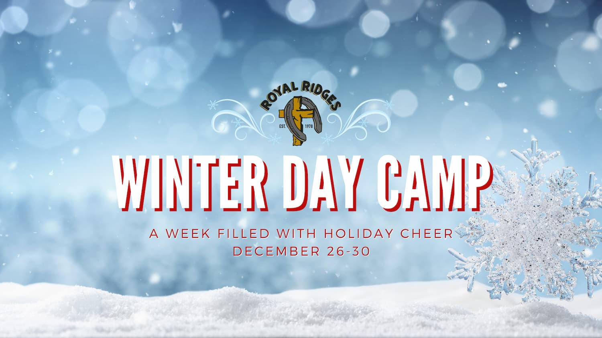

Where: Royal Ridges

When: December 26th - 30th 

Time: 9:00am - 3:00pm

Cost: $175 a participant

Horse Option Add On: $150

**Join us this Christmas break for our Winter Day Camp as we create 5 days of fun-filled holiday-themed adventures for campers from Kindergarten through 6th grade. We are looking forward to filling camp with the joy of the season.  We also offer a break-out horse activity for those kiddos who love horses. We are offering limited bus service for the first time for our winter camps so let us do the driving. Space is limited. Click on the image above for more information and to register for camp.**

    <a 
        href='https://www.ultracamp.com/info/upcomingSessions.aspx?idCamp=1145&campCode=151&lnkCategory=Winter+Break+Camp'
        className='text-green-200 hover:text-indigo-400 hover:underline font-cursive text-2xl'
        target='_blank' 
        rel='noopener noreferrer'
    >Register for Winter Camp</a>

**Bus Routes - Winter 2022** 
*Please note bus times are subject to change due to inclement weather*.

**West Bus Route: Winter** 
***Albertsons at Salmon Creek***
 8:15 AM - Departure Time\
4:05 PM - Drop Off Time - Final Stop
14300 NE 20th Ave Vancouver, WA 
Northside by Dumpster 

***Battle Ground Baptist Church***
8:40 - Departure Time
3:20 - Drop off Time
1110 NW 6th Ave., Battle Ground, WA
FRONT PARKING LOT   

**East Bus Route: Winter**
***NW Gospel Church***
8:05 AM - Departure Time
4:05 PM - Drop Off Time

305 NE 192nd Ave, Vancouver, WA 98684 
NorthWest Parking Lot in Front of the Church

***Brush Prairie Baptist Church*** 
8:35 AM - Departure Time
3:35 PM - Drop Off Time

11814 NE 117th Ave, Vancouver, WA 98662 
NW Corner of Main Parking Lot off of 119th St